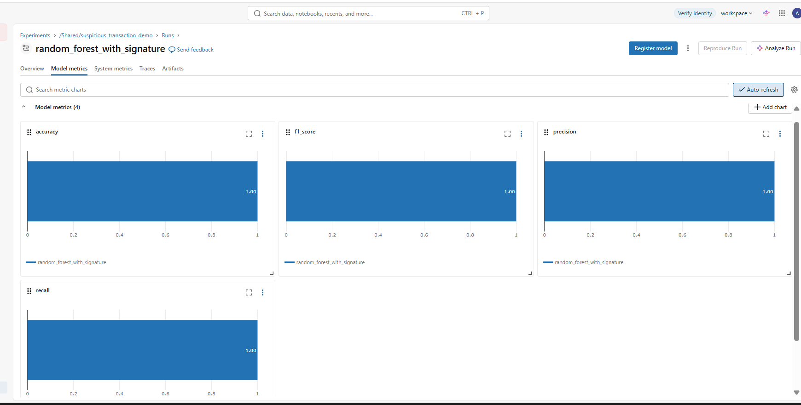
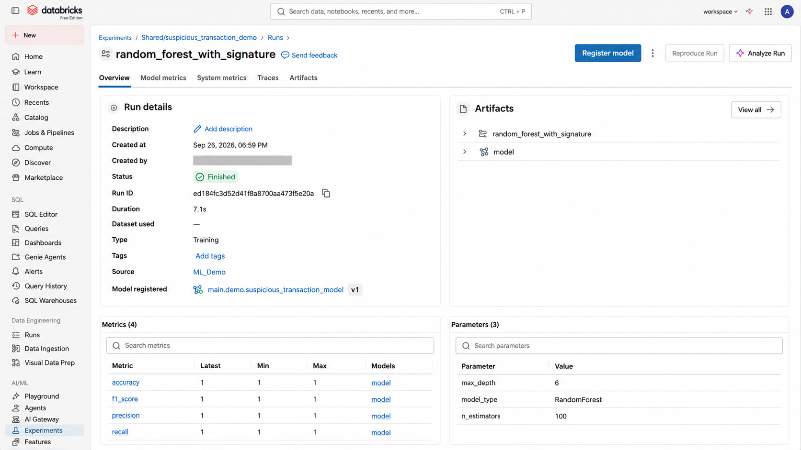

# Suspicious Transaction Detection on Databricks

End-to-end Databricks ML demo that generates synthetic payment transactions, engineers behavioral features, trains a Random Forest classifier, scores transactions, tracks the experiment with MLflow, and registers the model in Unity Catalog.

> **Demo only:** suspicious records are intentionally easy to distinguish. The resulting metrics are not representative of production fraud-detection performance.

## Architecture

```text
Synthetic transactions
        |
        v
main.demo.transaction
        |
        v
main.demo.transaction_labels
        |
        v
main.demo.transaction_ml_features
        |
        v
Random Forest (scikit-learn)
        |-------------------|
        v                   v
Predictions          Risk probability
        |                   |
        +---------+---------+
                  v
main.demo.transaction_predictions
                  |
                  v
               MLflow
                  |
                  v
      Unity Catalog Model Registry
```

## What the demo shows

- Delta/Unity Catalog tables in Databricks
- Deterministic synthetic transaction generation
- Synthetic suspicious behavior: rapid, high-value, cross-border activity
- SQL window features such as transaction velocity
- Stratified train/test split
- Random Forest classification with class balancing
- Precision, recall, F1, and accuracy tracking
- Feature importance
- Batch scoring and Delta prediction output
- MLflow model logging with an input signature
- Unity Catalog model registration

## Repository layout

```text
.
├── README.md
├── requirements.txt
├── assets/
│   └── mlflow-model-metrics.png
├── notebooks/
│   └── suspicious_transaction_demo.py
└── docs/
    └── original-working-steps.md
```

## Prerequisites

- Databricks workspace with Unity Catalog enabled
- Permission to create objects in catalog/schema `main.demo` (or update `CATALOG` / `SCHEMA` in the notebook)
- Databricks Runtime with Python, pandas, scikit-learn, and MLflow available

## Run

1. Import `notebooks/suspicious_transaction_demo.py` into Databricks as a source notebook, or add the repo through Databricks Git folders.
2. Attach a compute resource.
3. Run the notebook from top to bottom.
4. Inspect `main.demo.transaction_predictions`.
5. Open the MLflow experiment `/Shared/suspicious_transaction_demo`.
6. Inspect the registered model `main.demo.suspicious_transaction_model`.

The notebook resets the demo transaction table before loading synthetic data, so reruns do not keep appending the same base dataset.

## Expected data volume

- 10,000 normal transactions
- 100 synthetic suspicious transactions (25 users x 4 transactions)
- 10,100 total transactions

The class imbalance is intentional and the train/test split uses stratification.

## Features

The model uses:

- `txn_amount`
- `is_cross_border`
- `txn_hour`
- `user_txn_count`
- `merchant_txn_count`
- `merchant_avg_amount`
- `transactions_last_10_min`

## Important modeling caveat

This repository reproduces a working **demo**, not a production fraud model. Some aggregate features (`user_txn_count`, `merchant_txn_count`, and `merchant_avg_amount`) are computed across the complete demo dataset. That can expose future information to earlier rows. In production, features should be point-in-time correct and calculated only from information available before each transaction.

The synthetic label is also generated directly from the synthetic suspicious-user convention. Production labels should instead come from confirmed fraud, chargebacks, investigations, or another governed outcome source.

## MLflow / Unity Catalog

The notebook logs parameters, evaluation metrics, an input example, and a model signature. It also attempts programmatic registration in Unity Catalog using the run artifact URI. If your workspace governance process requires manual approval/registration, you can omit that final registration cell and register the successful MLflow run through the Databricks UI.

## Production extensions

A production version should consider point-in-time feature engineering, categorical/device features, threshold tuning, PR-AUC/ROC-AUC, calibration, temporal validation, drift monitoring, model monitoring, retraining, explainability, and governed labels.

## Disclaimer

This project uses synthetic data and is intended for demonstration and learning purposes only.

## Model results

The Random Forest run produced **1.00 accuracy, precision, recall, and F1-score** on the synthetic test split. These values validate that the demonstration pipeline can learn the deliberately strong synthetic signal; they should **not** be interpreted as expected production fraud-detection performance.

The suspicious examples were intentionally generated with highly distinguishable characteristics such as high transaction amounts, rapid transaction velocity, and cross-border activity. Real transaction behavior overlaps much more, so production evaluation should use realistic governed labels, temporal validation, point-in-time features, threshold analysis, and additional metrics such as PR-AUC.



### What this result demonstrates

- The training and evaluation pipeline executed successfully in Databricks.
- Accuracy, precision, recall, and F1 were logged to MLflow.
- The model run is reproducible and visible through the Databricks experiment UI.
- The screenshot is evidence of the end-to-end MLflow tracking workflow, rather than a claim of production-level predictive performance.

## MLflow Model Results

The Random Forest experiment was tracked in Databricks MLflow with the following test metrics on the synthetic demonstration dataset:

- Accuracy: **1.00**
- Precision: **1.00**
- Recall: **1.00**
- F1-score: **1.00**


> **Important:** These metrics should not be interpreted as expected production performance. The synthetic suspicious transactions were intentionally generated with strongly distinguishable patterns, including high transaction amounts, rapid transaction velocity, and cross-border activity. The goal is to demonstrate an end-to-end Databricks ML workflow, not to benchmark a production fraud-detection model.

## MLflow Run & Unity Catalog Registration

The completed MLflow run also captures the model artifacts, training parameters,
and the registered Unity Catalog model (`main.demo.suspicious_transaction_model`).



The screenshot is privacy-safe: personal account information has been masked while
preserving the technical experiment details.
